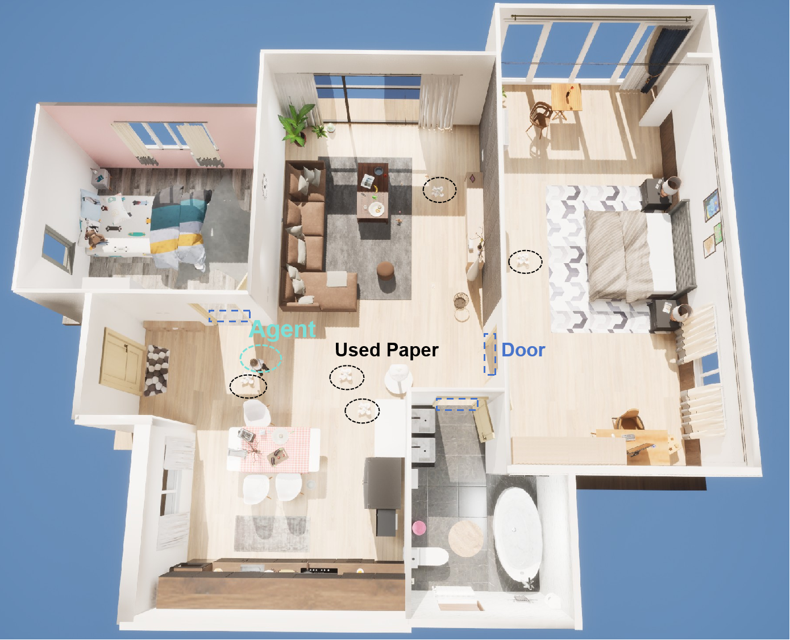

# Task Overview

This project is a benchmark specifically designed to evaluate an agent’s exploration and navigation capabilities. It centers on the challenging task of cleaning up all paper balls indoors: the agent must collect paper balls scattered on the floor within a complex multi-room indoor environment where each room contains multiple obstacles. The positions and counts of paper balls are random, and the agent’s initial position is also random. The task ends when the agent has visited the entire indoor space and cleaned all paper balls (success), or when the agent’s movement steps exceed the upper limit (failure).
The task scenario is shown below:

***Figure 1**. Task Environment*

## Main Challenges

* **Exploration & Coverage**: The environment topology is complex with doors and corridor constraints between rooms. The agent needs to efficiently explore and ensure complete spatial coverage in an unknown, multi-room, multi-obstacle environment, balancing “exploring unknown areas” and “returning to uncleaned areas.”
* **Perception & Target Recognition**: Randomly distributed paper balls pose challenges for perception and localization under partial observability. The agent must accurately detect, map, and maintain target states amid visually cluttered scenes.
* **Planning & Decision-Making**: With a random initial position and dynamic perceptual feedback, the agent must plan paths and action sequences on the fly to complete the task optimally, and be able to re-plan in real time as goals and spatial states change.

## Implementation

* This benchmark is built on the TongSIM simulation platform, providing configurable, realistic indoor environments for agent training and evaluation.
* The RL environment is wrapped following the Gymnasium interface specification to ensure compatibility with mainstream RL toolchains.
* Baseline agents are trained using the `Stable-Baselines3` framework, enabling reproducible performance comparisons across algorithms. In addition, the system supports human-in-the-loop testing, allowing human participants to interact with the environment for qualitative evaluation and behavioral comparison.
