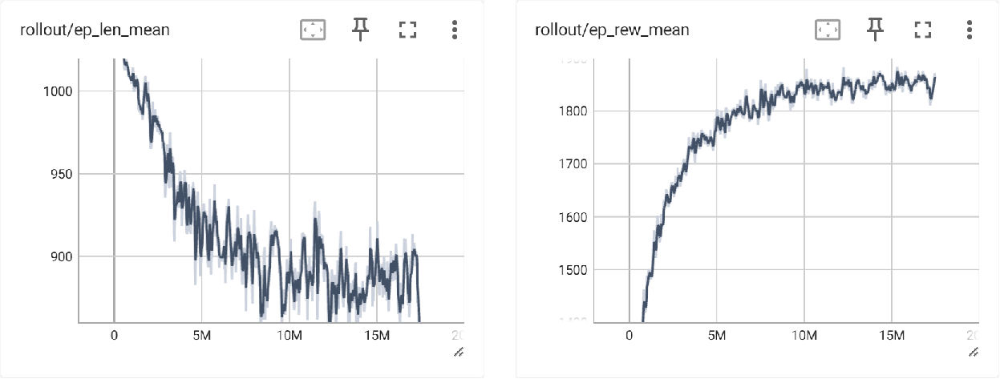

# 训练

## 环境
`CollectTask`类继承自`gymnasium.Env`，并实现了其标准接口规范。

为简化问题，本项目中的环境将三维场景投影到二维地面并进行离散化，生成占用网格地图。障碍物、智能体与目标分别位于三个独立图层中，每个图层均采用 one-hot 编码表示。


**观测空间**

智能体观测数据包括以智能体为中心的局部网格信息以及与下一个目标点的相对位置信息。
```python
spaces.Dict(
    {
        "grid_tensor": spaces.Box(
            low=0,
            high=1,
            shape=(3, view_size, view_size),
            dtype=np.uint8,
        ),
        "target_direction": spaces.Box(
            low=np.array([-tgt_dir_max, -tgt_dir_max]),
            high=np.array([tgt_dir_max, tgt_dir_max]),
            shape=(2,),
            dtype=np.int8,
        ),
    }
)
```
`grid_tensor`表示以智能体为中心的局部网格信息，大小为`view_size*view_size`。`target_direction`为智能体与下一个目标点的相对位置。

**动作空间**

智能体的动作空间包括两部分，一是移动方向，二是移动步长。
```python
spaces.MultiDiscrete([4, 2])
```
第一维度是智能体能够移动的方向，包括前、后、左、右四个方向，第二维度是离散占用网格地图中移动的步长，默认有两种步长，包括一格、二格。

**环境创建**

本项目对创建任务环境进行了封装，主要配置的参数包括`grpc_endpoint、anchor`、`max_steps`、`render_mode`。
```python
def make_env(grpc_endpoint, anchor, max_steps=1024, render_mode=None):
    """Creates a function that initializes a CollectTask environment with the specified anchor point."""
    def _init():
        ue = ts.TongSim(grpc_endpoint=grpc_endpoint)
        return CollectTask(
            ue=ue,
            anchor=anchor,
            grid_size=para.GRID_SIZE,
            view_size=para.VIEW_SIZE,
            max_steps=max_steps,
            render_mode=render_mode,
        )

    return _init
```

`grpc_endpoint`是与TongSIM仿真环境连接所需的配置，如果在同一台机器上运行，则默认为`"127.0.0.1:5726"`。TongSIM仿真环境支持加载多个子地图以实现并行化，`anchor`为当前地图加载的世界坐标系下的锚点，为了保证子地图之间在空间上不重合，锚点对应间隔需要大于子地图的长/宽/高。

**环境运行**

与Gymnasium一样，创建环境后，执行`reset`重置环境，智能体基于观测给出动作，将动作输入给环境以获取下一个观测，如此循环以实现智能体与环境的交互。
```python
with ts.TongSim(grpc_endpoint=para.GRPC_ENDPOINT) as ue:
    ue.context.sync_run(ts.UnaryAPI.reset_level(ue.context.conn))
    max_steps = 1024
    env = make_env(
        grpc_endpoint=para.GRPC_ENDPOINT,
        anchor=(0, 0, 0),
        max_steps=max_steps,
        render_mode="human",
    )()
    env = InputWrapper(env)
    obs, _ = env.reset()
    done = False
    steps = 0
    while not done:
        steps += 1
        obs, reward, terminated, truncated, info = env.step()
        done = terminated or truncated
        env.render()
        time.sleep(0.01)
```
上述代码以人类接入为例说明如何运行环境。`InputWrapper`为键盘输入封装，该类在`./common/manual.py`中实现，执行上述代码启动运行环境，在终端中输出动作，仿真环境中的智能体会执行对应的动作。

## 训练

**第一步：生成占用网格地图**

除智能体和目标外，场景中的物品在训练前后保持不变，所以可以预先生成环境的占用网格地图，用于后续的训练。

生成函数为：
```python
async def request_global_map(
    context: WorldContext, wx: int = 512, wy: int = 512, h: int = 64
):
    start_transform = ts.Transform(location=ts.Vector3(para.ROOM_CENTER))
    voxel_bytes = await ts.UnaryAPI.query_voxel(
        context.conn,
        start_transform,
        wx,
        wy,
        h,
        ts.Vector3(para.ROOM_EXT),
    )
    vox = decode_voxel(voxel_bytes, (wx, wy, h))
    vox_flattened = np.any(vox, axis=-1, keepdims=False)
    vox_flattened_img = vox_flattened.astype(np.uint8) * 255
    Image.fromarray(vox_flattened_img).save(
        f"./examples/rl_nav/occupy_grid/global_map_{wx}.png"
    )
    return vox_flattened
```
其中，`start_transform`为要生成网格的中心空间位置，`box_extent`为要生成网格的空间范围，`wx`为x方向上的网格数，`wy`为y方向上的网格数，`h`为z方向上的网格数。

打开TongSIM仿真环境，选择并加载要生成网格的地图，运行仿真环境，调用python接口来获取占用网格数据。具体的调用方式为：
```python
    with ts.TongSim(grpc_endpoint="127.0.0.1:5726") as ue:
        ue.context.sync_run(request_global_map(ue.context, wx=512, wy=512, h=64))
```
调用成功后，会在 `./examples/rl_nav/occupy_grid`目录下生成png格式的占用网格地图。

**第二步：配置模型**

本项目基于`stable_baselines3`框架进行训练，模型相关参数配置如下：

```python
def make_model(envs, last_path, tsboard_log_path):
    if last_path is not None and os.path.exists(last_path):
        print(f"[INFO] load already trained model: {last_path}")
        model = PPO.load(last_path, env=envs)
    else:
        print("[INFO] not found trained model, create a new model.")
        model = PPO(
            "MultiInputPolicy",
            envs,
            learning_rate=2e-4,
            n_steps=1024,
            batch_size=128,
            n_epochs=8,
            gamma=0.99,
            gae_lambda=0.98,
            clip_range=0.15,
            ent_coef=0.03,
            vf_coef=0.6,
            verbose=1,
            tensorboard_log=tsboard_log_path,
            # policy_kwargs=policy_kwargs,
            device="cpu",
        )
    return model
```

**第三步：创建并行环境训练**

TongSIM 原生支持并行训练。将 `env_num` 设为并行环境数量，提升样本吞吐与收敛效率。创建矢量化环境后配置模型超参数，即可启动训练。
```python
def train(model_name=None):
    """Trains the RL navigation model using multiple parallel environments."""
    with ts.TongSim(grpc_endpoint=para.GRPC_ENDPOINT) as ue:
        # reset level
        ue.context.sync_run(ts.UnaryAPI.reset_level(ue.context.conn))
        env_num = 25
        row_num = 5
        envs = SubprocVecEnv(
            [
                make_env(
                    grpc_endpoint=para.GRPC_ENDPOINT,
                    anchor=(x * 2000, y * 2000, 0),
                    max_steps=1024,
                    render_mode=None,
                )
                for i in range(env_num)
                for x, y in [divmod(i, row_num)]
            ]
        )
        envs = VecMonitor(envs, log_dir + "/vecmonitor_log")
        model = make_model(
            envs=envs,
            last_path=None if model_name is None else model_dir + model_name,
            tsboard_log_path=log_dir + "/tsboard_log",
        )

        checkpoint_callback = CheckpointCallback(
            save_freq=50_000 // env_num,
            save_path=model_dir,
            name_prefix="search_ppo",
        )
        try:
            model.learn(
                total_timesteps=1e9,
                callback=checkpoint_callback,
            )
        except Exception as e:
            print(f"[ERROR] error occurred while training: {e}")
            model.save(model_dir + "/search_ppo_crash")
            raise
        finally:
            model.save(model_dir + "search_ppo_final")
```

**训练日志**

基于上述参数配置，训练日志结果如以下所示：


***图 1**. 训练日志: 平均回合步数 (左), 平均回合奖励 (右)*

从图中可以看出，智能体完成任务所需的步数越来越少，获得的奖励越来越高，在训练10M步之后，步长和奖励趋于收敛。

## 评估

本任务的评估指标主要包含两个，一是成功率*SR*，二是效率*E*。成功是指智能代理能够在最大步数内完成对整个任务空间的扫描并将所有纸团遍历访问。效率是指智能体代理完成任务的快慢程度，通过步数来衡量，步数越少效率越高。两个参数的具体计算公式见技术报告。

模型训练结束之后，将工作目录切换到项目根目录下，执行：

```bash
uv run python ./examples/rl_nav/run.py test --model_name="xx.zip"
```

将`model_name`替换成自己的模型文件名。执行评估脚本，结束后自动输出成功率和效率指标。

利用这个基准，我们评估了baseline模型和人类，结果如下表所示：

 <b>Table 1.</b> 人类和RL模型在本任务中的表现
| Agent | *SR* |  *E* |
| :---: | :--: | :--: |
| PPO   |  0.6 | 0.34 |
| Human |  1.0 | 0.54 |
